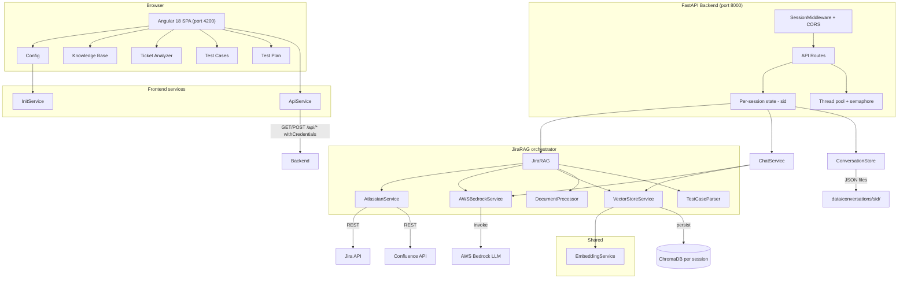
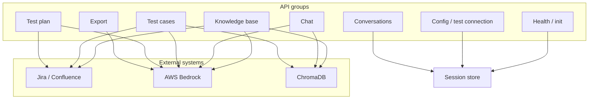

# QA Assistant – Architecture

This document describes the architecture of the QA Assistant (Hyland) application: Angular frontend, FastAPI backend, session management, and service integration.

---

## Architecture diagram





---

## 1. High-level overview

```
┌─────────────────────────────────────────────────────────────────────────┐
│                         Browser (Session)                                │
│  ┌──────────────────────────────────────────────────────────────────┐  │
│  │  Angular 18 SPA (port 4200)                                        │  │
│  │  • Configuration • Knowledge Base • Ticket Analyzer               │  │
│  │  • Test Cases • Test Plan                                          │  │
│  └──────────────────────────────────────────────────────────────────┘  │
│                                    │                                    │
│                          /api/* (proxy, withCredentials)                │
│                                    ▼                                    │
└─────────────────────────────────────────────────────────────────────────┘
                                     │
┌─────────────────────────────────────────────────────────────────────────┐
│  FastAPI Backend (port 8000)                                              │
│  • SessionMiddleware (cookie: qa_session)                                │
│  • Per-session: JiraRAG, ChatService, ConversationStore                  │
│  • CORS (credentials allowed)                                            │
└─────────────────────────────────────────────────────────────────────────┘
         │                    │                    │
         ▼                    ▼                    ▼
   Jira/Confluence      AWS Bedrock           ChromaDB
   (Atlassian API)      (LLM)                 (vector store)
```

- **Frontend**: Single-page Angular app; all API calls go to `/api` and are proxied to the backend in development. Cookies are sent so the backend can identify the session.
- **Backend**: FastAPI with session-scoped state. Each session has its own RAG instance, chat service, and conversation store. No shared global state across users/browsers.
- **External**: Jira/Confluence (Atlassian), AWS Bedrock (LLM), ChromaDB (local vector store per session).

---

## 2. Frontend (Angular)

### 2.1 Stack and structure

- **Framework**: Angular 18, standalone components.
- **Routing**: `app.routes.ts` defines routes; protected routes use `initGuard`, which checks initialization and redirects to `/config` if not initialized.
- **State**: `InitService` holds initialization status (from `GET /api/init-status`) and exposes `initialized$` and `setInitialized()` for the rest of the app.

### 2.2 Main components and routes

| Route              | Component        | Purpose                                                                 |
|--------------------|------------------|-------------------------------------------------------------------------|
| `/config`          | ConfigComponent  | Jira/Confluence/AWS configuration; Initialize; Advanced settings (model, etc.). |
| `/knowledge-base`  | KnowledgeBaseComponent | Populate KB from tickets, Confluence URLs, uploads.                 |
| `/ticket-analyzer` | TicketAnalyzerComponent | Load tickets, chat with AI, quick actions, model selection.         |
| `/test-cases`      | TestCasesComponent     | Generate test cases (with optional instructions), refine all/one, **confidence-score guardrail** (low-confidence cases require human approval before publishing), **Check Xray for duplicates**, publish to Xray (skips duplicate summaries by default), export. |
| `/test-plan`       | TestPlanComponent      | Generate/refine test plan, publish to Confluence.                      |

All except `/config` are protected by `initGuard`.

### 2.3 Key frontend services

- **ApiService**: HTTP client for `/api`; all methods use `withCredentials: true` so the session cookie is sent.
- **InitService**: Calls `GET /api/init-status`, keeps initialization state, used by guard and config/UI.
- **AiThinkingOverlayComponent** (`ai-thinking-overlay/`): Shared full-screen “thinking” modal (brain icon, step checklist, optional stop) used during long operations on Test Cases, Test Plan, Ticket Analyzer, Knowledge Base, Configuration, and Dashboard (model name load).

### 2.4 Data flow (frontend)

- **Config**: User enters credentials and AWS profile → `POST /api/init` → on success, `InitService.setInitialized(true)` and success popup; model list refreshed.
- **Test cases**: User can set “Instructions for generation” → Generate calls `POST /api/test-cases/generate` with `user_instructions`; results shown as editable items. Each test case receives an AI **confidence score** (1-5); cases with confidence below 3 are flagged **Needs Review** and blocked from publishing until the user explicitly approves them (human-in-the-loop guardrail). “Apply feedback to all” → `POST /api/test-cases/refine`; “Apply feedback” on one item → `POST /api/test-cases/refine-single`. **Check Xray for duplicates** → `POST /api/test-cases/check-xray-duplicates` (Jira search by comparable summary). Publish uses `write-to-xray` or `write-to-xray-selected` with `skip_if_duplicate` (default true) so existing Tests with the same normalized summary are not recreated. Jira browse links use `GET /api/connection-settings` for `jira_server`.
- **Ticket analyzer**: Model list from `GET /api/bedrock-models` (no params so backend uses session config); default model from `GET /api/init-status` → `current_model_id`.

---

## 3. Backend (FastAPI)

### 3.1 Entry and middleware

- **Entry**: `main.py`; app lifecycle via `lifespan` (creates data/conversations dirs).
- **Middleware order** (first added = innermost):
  1. **SessionMiddleware** (Starlette): cookie `qa_session`, signed with `SESSION_SECRET_KEY`; `max_age` 14 days; `same_site="lax"`. Ensures each browser gets a stable session.
  2. **CORSMiddleware**: Origins `localhost:4200`, `127.0.0.1:4200`; `allow_credentials=True` so cookies are accepted.

### 3.2 Concurrency and performance

Blocking work (LLM calls, ChromaDB, Jira/Confluence/Bedrock I/O) is run in the **custom thread pool** (configurable, default 64) via `run_sync()`, so the async event loop stays responsive. When one user’s request is waiting on an LLM or external API, other users’ requests (e.g. init-status, chat state, or another init) can still be handled. Heavy endpoints are capped by a semaphore; one shared embedding model is reused; Bedrock model list is cached; session eviction and rate limiting apply. For ~100 users use one Uvicorn worker. See README "Performance and scaling" for env vars.

### 3.3 Session and per-session state

- **Session ID**: `get_session_id(request)` ensures `request.session["sid"]` is set (UUID); creates one on first request.
- **Stores** (in-memory dicts keyed by `sid`):
  - `_rag_by_sid`: `JiraRAG` per session (Jira/Confluence, AWS, vector store, LLM, test parser).
  - `_chat_by_sid`: `ChatService` per session (ticket context, messages, model, RAG toggle).
  - `_conversation_store_by_sid`: `ConversationStore` per session; persistence under `data/conversations/<sid>/`.

**Initialization** (`POST /api/init`): Validates Jira URL, username, API token, AWS profile; creates `JiraRAG`, `ChatService`, and `ConversationStore`; stores them in the three dicts for that session’s `sid`. Only that session is “initialized.”

### 3.4 Dependencies and API groups

- **Dependencies**: `get_session_rag`, `get_session_chat`, `get_session_conversation_store` — each resolves the current request’s `sid` and returns the corresponding instance or raises 400 “Not initialized.”
- **API groups**:
  - **Health / init**: `GET /api/health`, `GET /api/init-status`, `POST /api/init`.
  - **Config/test**: `POST /api/test-connection`, `POST /api/test-connection-with-config`, `GET /api/bedrock-models`.
  - **Knowledge base**: `POST /api/kb/populate`, `DELETE /api/kb`, `GET /api/kb/count`.
  - **Chat**: `POST /api/chat/message`, quick-action, add/remove ticket/attachment, `GET /api/chat/state`, clear, use-rag, switch-model, post-to-jira, export.
  - **Conversations**: list, save, load, delete (all use session’s `ConversationStore`).
  - **Test cases**: generate (with optional `user_instructions`), refine (all), refine-single (one), **check-xray-duplicates**, write-to-xray, write-to-xray-selected (both support `skip_if_duplicate`; selected body includes `output_format`).
  - **Test plan**: generate, refine, publish.
  - **Export**: Excel (export service, no session).

---

## 4. Backend services (app layer)

### 4.1 JiraRAG (orchestrator)

- **Role**: Single facade for test case/test plan generation, knowledge base, and Jira/Confluence/Xray.
- **Dependencies**: AtlassianService, AWSBedrockService, VectorStoreService, DocumentProcessor, TestCaseParser; configured via `RAGConfig`, `AWSConfig`, `AtlassianConfig`.
- **Main behaviors**:
  - **Knowledge base**: `populate_vector_db(ticket_ids, confluence_urls, files)` → fetch content, chunk, embed, store in ChromaDB. `clear_kb()`, `collection.count()`.
  - **Test cases**: `generate_test_cases(ticket_id, output_format, use_knowledge_base, source_type, user_instructions)` → fetches requirement from Jira or Confluence, builds prompt with context (and optional user instructions), invokes LLM, returns raw text. `parse_test_cases(text, output_format)` → list of `{id, title, content, confidence?}`. `refine_test_cases(current_tests, output_format, feedback)` and `refine_single_test_case(test_case, output_format, feedback)` for refinement.
  - **Test plan**: `generate_test_plan(...)`, `refine_test_plan(current_plan, feedback)`, `publish_test_plan_to_confluence(...)`.
  - **Xray**: `bulk_create_xray_tests(payload, project_key, output_format, skip_if_duplicate)` via AtlassianService; `check_xray_duplicates`, `find_existing_xray_test` for Jira lookup before create.

### 4.2 AtlassianService

- **Role**: Jira and Confluence API access; Xray test creation and duplicate detection.
- **Uses**: `jira` library, `atlassian-python-api` (Confluence).
- **Capabilities**: Jira ticket details, Confluence page content, add comment, create Xray test issues (summary aligned with **`app/services/xray_duplicate.py`** — `extract_xray_comparable_summary`: BDD uses `title`, Xray format uses `**Test Summary:**` else `title`), **find_existing_xray_test** (JQL + normalized summary match; tie-break oldest `created`), **check_xray_duplicates** (batch). Issue type name defaults to `Test`; override with env **`XRAY_TEST_ISSUE_TYPE_NAME`** (see `AtlassianConfig`). Pure helpers in `xray_duplicate.py` are unit-tested in `backend/tests/test_xray_duplicate.py`.

### 4.3 AWSBedrockService

- **Role**: LLM invocation (Bedrock); model switching; optional inference profile.
- **Uses**: `boto3` (Bedrock runtime); session from AWS profile.
- **Capabilities**: `invoke(prompt)`, `test_connection`, `is_initialized`, `switch_model(model_id)`. Model list for UI via `fetch_bedrock_models_for_ui(region, profile)`.

### 4.4 VectorStoreService

- **Role**: Embeddings and vector store (ChromaDB).
- **Uses**: LangChain Chroma, embedding model (e.g. sentence-transformers), persist directory per RAG instance.
- **Capabilities**: add documents, retrieve by query, count; used for RAG context in test case generation and ticket analyzer.

### 4.5 DocumentProcessor

- **Role**: Chunk and parse uploaded files (PDF, DOCX, TXT, MD, etc.) for ingestion into the vector store.

### 4.6 TestCaseParser

- **Role**: Parse LLM output into structured test cases (BDD Gherkin or Xray format); extract `CONFIDENCE_SCORES` section (1-5 per case, used by the frontend's human-in-the-loop approval guardrail); `split_xray_test_cases` for refinement; `normalize_and_reindex` for stable IDs. BDD parsing normalizes **Scenario 1:** / **Scenario 2:** (and similar) into separate scenarios and avoids treating Feature+Background-only blocks as a single test case when section headings precede scenarios.

### 4.7 ChatService

- **Role**: Ticket analyzer chat: tickets, attachments, message history, optional RAG context; quick actions (summarize, gaps, risk, test suggestions).
- **Uses**: Same `AWSBedrockService` and `VectorStoreService` as JiraRAG; prompts for chat and quick actions.

### 4.8 ConversationStore

- **Role**: Save/load/delete conversation snapshots (JSON) under `data/conversations/<sid>/` so each session has its own history.

### 4.9 ExportService

- **Role**: Export test cases to Excel (and other formats); stateless, no session.

---

## 5. Prompts and configuration

- **Prompts**: `app/prompts/templates.py` — test case (base + BDD/Xray), refinement (single and bulk), test plan, format guards. Test case prompt includes `{user_instructions}`; backend passes optional user instructions from the UI.
- **Config**: `app/config/settings.py` — `RAGConfig`, `AWSConfig`, `AtlassianConfig`; fallback Bedrock model list for UI.

---

## 6. Data and persistence

- **Backend data dir**: `backend/data/` (or configured path); subdirs for ChromaDB and `conversations/<sid>/`.
- **No shared DB**: State is in-memory per session (RAG, chat, store references); ChromaDB and conversation files are on disk, keyed by session or RAG config (e.g. persist path).

---

## 7. Security and deployment notes

- **Sessions**: Cookie is signed; set `SESSION_SECRET_KEY` in production. Session state is server-side only in memory (session id in cookie).
- **Credentials**: Jira/Confluence and AWS are provided at init and kept in the session’s JiraRAG; not persisted in the cookie.
- **CORS**: Backend allows specific origins with credentials; for production, set `allow_origins` to the frontend origin(s).
- **Auth**: No user authentication yet; session only scopes init. Plan is to add SSO/auth and not expose the API without it.

---

## 8. Summary diagram (services)

```
                    FastAPI main.py
                           │
         ┌─────────────────┼─────────────────┐
         │                 │                 │
   get_session_rag   get_session_chat   get_session_conversation_store
         │                 │                 │
         ▼                 ▼                 ▼
    JiraRAG           ChatService      ConversationStore
         │                 │                 │
    ┌────┴────┐       (uses RAG’s       (file system
    │         │        aws_service      per sid)
    ▼         ▼        & vector_store)
Atlassian  AWSBedrock
Service    Service
    │         │
    ▼         ▼
VectorStore  DocumentProcessor  TestCaseParser
(ChromaDB)   (chunking)        (parse/split)
```

This architecture keeps each browser session isolated, uses a single orchestrator (JiraRAG) for QA flows, and integrates Jira/Confluence, Bedrock, and a local vector store with a clear separation of concerns.
