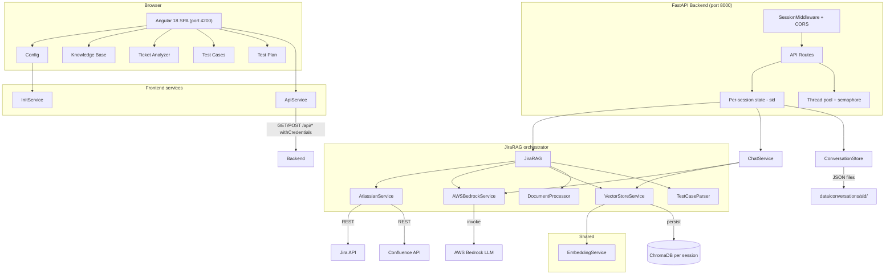
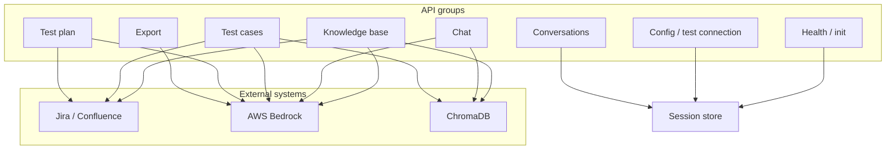
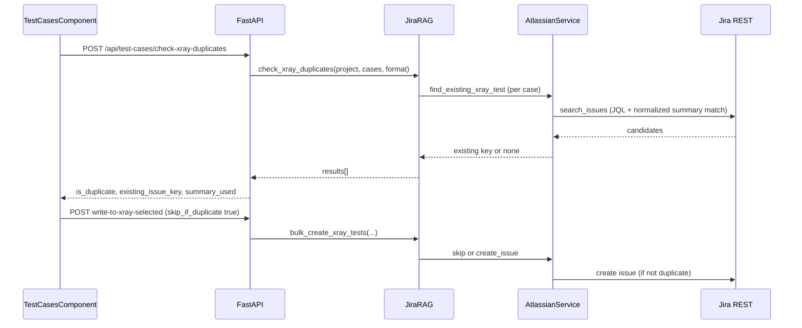
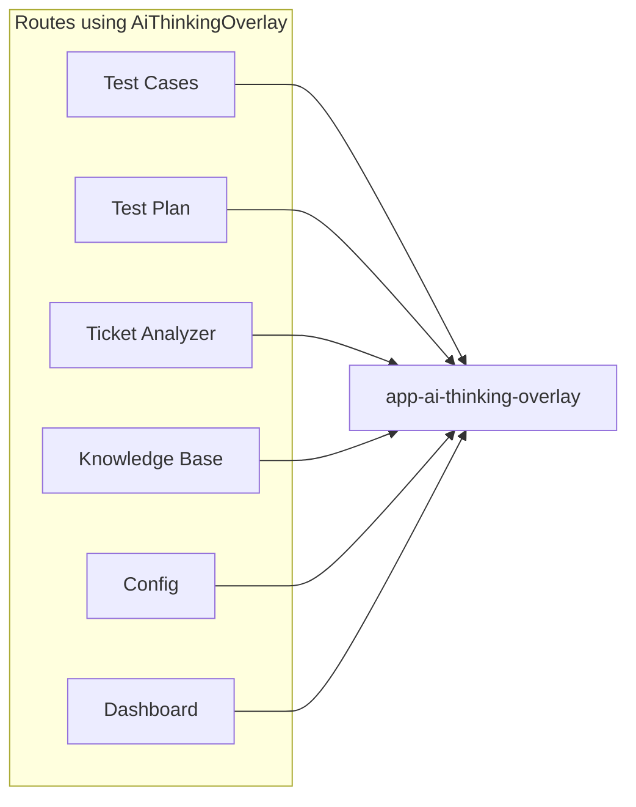

# QA Assistant – Architecture Diagram

The diagrams below are written in **Mermaid**. To see them as pictures instead of code:

1. **VS Code / Cursor**  
   - Open the Command Palette (`Ctrl+Shift+P` / `Cmd+Shift+P`), run **“Markdown: Open Preview”** to open the preview for this file.  
   - If you still only see code, install the extension **“Markdown Preview Mermaid Support”** (by Matt Bierner), then open the preview again. The diagrams will render in the preview pane.

2. **GitHub**  
   - Push this repo and open `docs/architecture-diagram.md` on GitHub. Mermaid is rendered automatically in markdown files.

3. **Online editor**  
   - Copy the contents of a ` ```mermaid ` block (without the backticks) into [mermaid.live](https://mermaid.live) to view or export the diagram.

## System overview



## Request flow (API groups → external systems)



## Test cases: Xray duplicate check and publish



## Frontend: shared thinking overlay


